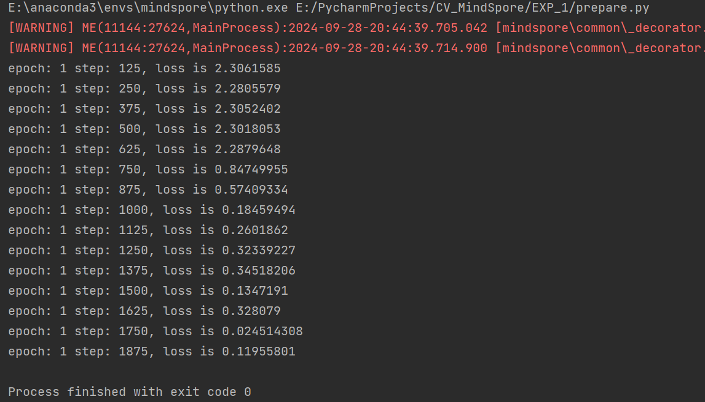

# 一、实验目的
近年来随着数据、计算能力、理论的不断发展演进，深度学习在图像、文本、语音、自动驾驶等众多领域都得到了广泛应用。与此同时，人们也越来越关注各类模型在使用过程中的安全问题，因为 AI 模型很容易受到外界有意无意的攻击而产生错误的结果。
本次实验我们将以梯度符号攻击 FGSM（Fast Gradient Sign Method）为例，演示此类攻击是如何误导模型的。

# 二、实验环境
|操作系统|编程环境|程序运行环境|
|:----:|:-----:|:-----:|
|Ubuntu 18.04|Visual Studio Code|python3.9+mindspore1.5.2|

# 三、实验原理
Szegedy 在 2013 年最早提出对抗样本的概念：在原始样本处加入人类无法察觉的微小扰动，使得深度模型性能下降，这种样本即对抗样本。如下图所示，本来预测为“panda”的图像在添加噪声之后，模型就将其预测为“gibbon”，右边的样本就是一个对抗样本：
<br>


对模型的攻击方法可以按照以下方法分类：

1. 攻击者掌握的信息多少：
- 白盒攻击：攻击者具有对模型的全部知识和访问权限，包括模型结构、权重、输入、输出。攻击者在产生对抗性攻击数据的过程中能够与模型系统有所交互。攻击者可以针对被攻击模型的特性设计特定的攻击算法。
- 黑盒攻击：与白盒攻击相反，攻击者仅具有关于模型的有限知识。攻击者对模型的结构权重一无所知，仅了解部分输入输出。

2. 攻击者的目的：
- 有目标的攻击：攻击者将模型结果误导为特定分类。
- 无目标的攻击：攻击者只想产生错误结果，而不在乎新结果是什么。

<br>
实验中用到的 FGSM 是一种白盒攻击方法，既可以是有目标也可以是无目标攻击。

# 四、实验步骤
## 1)配置实验环境：
```
import os
import numpy as np
from mindspore import Tensor, context, Model, load_checkpoint, load_param_into_net
import mindspore.nn as nn
import mindspore.ops as ops
from mindspore.common.initializer import Normal
from mindspore.train.callback import LossMonitor, ModelCheckpoint, CheckpointConfig
import mindspore.dataset as ds
import mindspore.dataset.transforms.c_transforms as C
import mindspore.dataset.vision.c_transforms as CV
from mindspore.dataset.vision import Inter
from mindspore import dtype as mstype
from prepare import create_dataset, LeNet5

context.set_context(mode=context.GRAPH_MODE)
```

## 2)运行 MNIST.sh 获取数据
`bash MNISH.sh`

## 3)训练一个 LeNet 网络作为演示：
`python prepare.py`

训练过程截图：
<br>


## 4)实现 FGSM
`python FGSM.py`

下面演示受攻击照片现在的实际形态，可以看出图片并没有发生明显的改变，然而在精度测试中却有了不一样的结果：
<br>


# 报错
- `AttributeError: module 'numpy' has no attribute 'str'.`
则注释 \site-packages\mindspore\common\dtype.py中的np.str: string,


