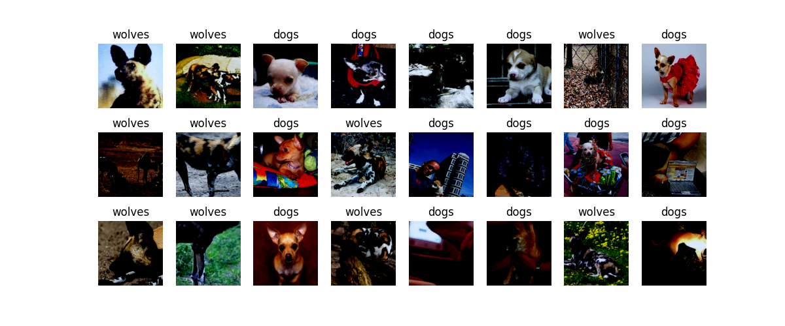

# <p align="center"> 图像分类迁移学习 </p>

## 一、实验目的
在实际场景中，为了减少从头开始训练所带来的时间成本，大多数情况下会基于已有的模型来进行迁移学习。
本次实验将会以狗和狼的图像分类为例，用 MindSpore 加载预训练模型，并通过固定权重来实现迁移学习。

## 二、实验环境
|操作系统|编程环境|程序运行环境|
|:----:|:-----:|:-----:|
|Ubuntu 18.04|Visual Studio Code|python3.9+mindspore1.5.2|

## 三、实验原理
在实际场景中，为了减少从头开始训练所带来的时间成本，大多数情况下会基于已有的模型来进行迁移学习。迁移学习可以使得预训练模型的先验知识得到更好的保留，提升下游任务的表达能力以及泛化能力。
<br>
## 四、实验步骤
### 1)数据、预训练模型准备
下载案例所用到的[狗与狼分类数据集](https://mindspore-website.obs.cn-north-4.myhuaweicloud.com/notebook/datasets/intermediate/Canidae_data.zip )，数据集中的图像来自于 ImageNet，每个分类有大约 120 张训练图像与 30 张验证图像。将下载后的数据集解压到当前目录下。
<br>
下载[预训练模型的 ckpt 文件](https://download.mindspore.cn/model_zoo/official/cv/resnet/resnet50_v1.5_ascend_0.3.0_cifar10_official_classification_20200718/resnet50.ckpt )，将其保存在当前目录。

### 2)数据处理
`详见 train.py 中的 create_dataset 方法`

### 3)可视化数据：
```
# 创建训练数据集
train_ds = create_dataset(train_data_path)

# 获取一批数据用于展示  
data = next(train_ds.create_dict_iterator())
images = data["image"]
labels = data["label"]

# 打印图像和标签的形状  
print("Tensor of image", images.shape)
print("Labels:", labels)

# 定义类别名称  
class_name = {0: "dogs", 1: "wolves"}
count = 1  # 用于控制子图的位置  

# 展示图像  
plt.figure(figsize=(12, 5))
for i in images:
    plt.subplot(3, 8, count)  # 假设每行3张图，总共8行（这里可能需要根据实际batch_size调整）  
    picture_show = np.transpose(i.asnumpy(), (1, 2, 0))  # 将CHW转换为HWC  
    picture_show = picture_show / np.amax(picture_show)  # 归一化到0-1  
    picture_show = np.clip(picture_show, 0, 1)  # 裁剪到0-1范围  
    plt.imshow(picture_show)  # 显示图像  
    plt.title(class_name[int(labels[count - 1].asnumpy())])  # 显示图像标题  
    plt.xticks([])  # 不显示x轴刻度  
    plt.axis("off")  # 不显示坐标轴  
    count += 1
plt.show()  # 显示图像
```

可视化结果：
<br>


### 4)训练模型：
定义 apply_eval 函数，用来验证模型的精度。
```angular2html
# 模型验证
def apply_eval(eval_param):
    eval_model = eval_param['model']
    eval_ds = eval_param['dataset']
    metrics_name = eval_param['metrics_name']
    res = eval_model.eval(eval_ds)
    return res[metrics_name]
```

我们自定义一个数据收集的回调类 EvalCallBack， 用于实现下面两种信息：
1. 训练过程中， 每一个 epoch 结束之后， 训练集的损失值和验证集的模型精度。
2. 保存精度最高的模型。
```angular2html
class EvalCallBack(Callback):
    """
    回调类， 获取训练过程中模型的信息
    """

    def __init__(self, eval_function, eval_param_dict, interval=1, eval_start_epoch=1, save_best_ckpt=True,
                 ckpt_directory="./", besk_ckpt_name="best.ckpt", metrics_name="acc"):
        super(EvalCallBack, self).__init__()
        self.eval_param_dict = eval_param_dict
        self.eval_function = eval_function
        self.eval_start_epoch = eval_start_epoch
        if interval < 1:
            raise ValueError("interval should >= 1.")
        self.interval = interval
        self.save_best_ckpt = save_best_ckpt
        self.best_res = 0
        self.best_epoch = 0
        if not os.path.isdir(ckpt_directory):
            os.makedirs(ckpt_directory)
        self.best_ckpt_path = os.path.join(ckpt_directory, besk_ckpt_name)
        self.metrics_name = metrics_name


    # 删除 ckpt 文件
    def remove_ckpoint_file(self, file_name):
        os.chmod(file_name, stat.S_IWRITE)
        os.remove(file_name)
        # 每一个epoch后， 打印训练集的损失值和验证集的模型精度， 并保存精度最好的ckpt文件


    def epoch_end(self, run_context):
        cb_params = run_context.original_args()
        cur_epoch = cb_params.cur_epoch_num
        loss_epoch = cb_params.net_outputs
        if cur_epoch >= self.eval_start_epoch and (cur_epoch - self.eval_start_epoch) % self.interval == 0:
            res = self.eval_function(self.eval_param_dict)
            print('Epoch {}/{}'.format(cur_epoch, num_epochs))
            print('-' * 10)
            print('train Loss: {}'.format(loss_epoch))
            print('val Acc: {}'.format(res))
            if res >= self.best_res:
                self.best_res = res
                self.best_epoch = cur_epoch
                if self.save_best_ckpt:
                    if os.path.exists(self.best_ckpt_path):
                        self.remove_ckpoint_file(self.best_ckpt_path)
                    save_checkpoint(cb_params.train_network, self.best_ckpt_path)


    # 训练结束后， 打印最好的精度和对应的 epoch
    def end(self, run_context):
        print("End training, the best {0} is: {1}, the best {0} epoch is {2} ".format(self.metrics_name, self.best_res, self.best_epoch), flush = True)
```

### 5)模型微调：
```angular2html
context.set_context(mode=context.GRAPH_MODE)
train_data_path = 'data/Canidae/train'
val_data_path = 'data/Canidae/val'

net = resnet50(2)
num_epochs = 20

# 加载预训练模型
param_dict = load_checkpoint('resnet50.ckpt')

# 获取全连接层的名字
filter_list = [x.name for x in net.end_point.get_parameters()]

# 删除预训练模型的全连接层
filter_checkpoint_parameter_by_list(param_dict, filter_list)

# 给网络加载参数
load_param_into_net(net, param_dict)

# 定义优化器和损失函数
opt = nn.Momentum(params=net.trainable_params(), learning_rate=0.001, momentum=0.9)
loss = nn.SoftmaxCrossEntropyWithLogits(sparse=True, reduction='mean')

# 实例化模型
model = Model(net, loss, opt, metrics={"Accuracy": nn.Accuracy()})

train_ds = create_dataset(train_data_path)
val_ds = create_dataset(val_data_path)
eval_param_dict = {"model": model, "dataset": val_ds, "metrics_name": "Accuracy"}
eval_cb = EvalCallBack(apply_eval, eval_param_dict, )
# 训练模型
model.train(num_epochs, train_ds, callbacks=[eval_cb, TimeMonitor()], dataset_sink_mode=True)
```
